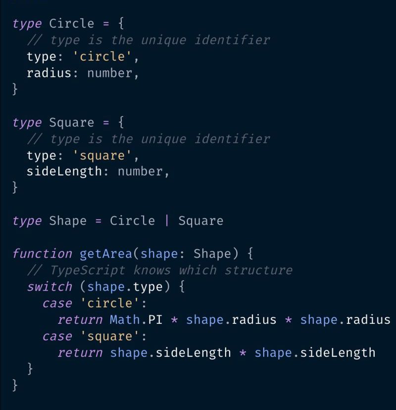

## Expectations
I didn't necessarily know what to expect when I realized we were learning TypeScript for class. I've wanted to do some basic web development for personal projects, but wasn't sure how much I wanted to know. I definitely didn't get off to the best start when I did two hours of the wrong JavaScript tutorial assignment. Imagine my pain when I realized I had to do another three hours of the actual one! Yippee!

Besides that minor setback, I don't have the fondest impressions of TypeScript/JavaScript. This mainly stems from the fact that I don't know it's main functionality, but so far it seems to be like the SUV Coupe of programming languages. All of the cons of the others, with none of the pros. Once I learn how to integrate it with HTML/CSS, I'm sure it'll become apparent why it's so widely used, but it's just pushing every one of my buttons. As someone who appreciates low-level programming like C, I cannot comprehend how people write good code in loosely typed languages. I understand that C isn't the most statically typed language out there, but it is much moreso than JS.

## WODs
That all being said, I do think that WODs will be useful for learning new languages. It gets my hands/brain used to adjusting to the new syntax, and allows me to train myself to react and plan quickly. From the examples we've used so far, I haven't experienced much stress. On the one hand I was able to complete them quicker than the Rx time without much difficulty. On the other hand, I've looked ahead and am not too thrilled with what I see.

All in all, this style of learning and the content I'm going to be learning will definitely take some getting used to, but I'm excited to see what it all has to offer.
