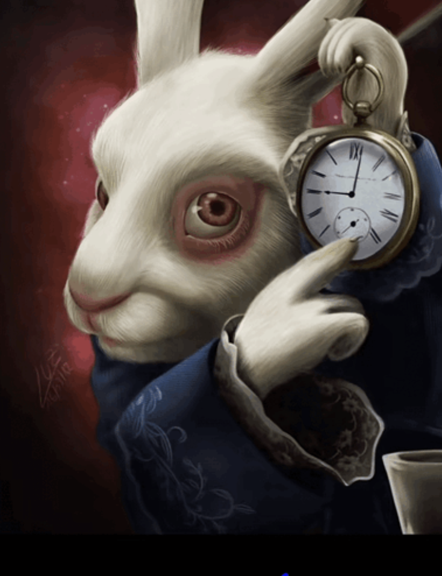

# Introduction
  Initially when I was told to track my effort and estimate it for all assignments in ICS314 I thought the idea was silly. I figured I could either just estimate in my head, or how long I spent wouldn't matter and I would just work until I was done. That being said, as the semester continued, I realized more and more how useful it was to complete even rough estimations.

# Discussion
  When I started, I made my effort estimations based off of a best guess. I knew I could get the assignments done pretty quickly, so I based my estimation off of the Rx time on the assignment description. As I progressed, I could use the historical data I had already gathered to more directly shape my estimations. This reflective behavior helped to inform future estimates *and* project decisions, because it allowed me to understand how long I spent on certain tasks, alongside knowing a baseline window of completion. That wasn't the only benefit it brought.

  I found that estimating my time and effort helped me stay focused and persevere. The main thing it did for me was it made me look at the estimated times on the assignment description, and I would use that to tell myself that I just needed to spend X amount of time to get something done. Additionally, I didn't want to get distracted and go on my phone because that would lengthen my time.

  Like I mentioned, I didn't want to go on my phone and increase my estimated time. I used my phone's stopwatch function to time myself, and I would start it right as I started typing and end it just before I submitted the assignments. I only truly tracked time, and not so much effort. This is compounded by the fact that I didn't use my stopwatch to track the time I spent thinking about the assignment before I would start coding. While my actual time estimates were pretty on point, this key component of not tracking thinking time led to significantly faster times than I might be able to produce in a testing environment.
  
# Conclusion
  All in all, there aren't many things that I would change about my estimation or tracking progress if I were to do this again. I think the slow evolution of my tracking progress was an important aspect of the process, and isn't something I would sacrifice for more accurate estimates. I believe that exact time estimates aren't the most important thing to take away from time tracking, but instead the idea of self reflection and not just throwing yourself at a problem is the key idea.
