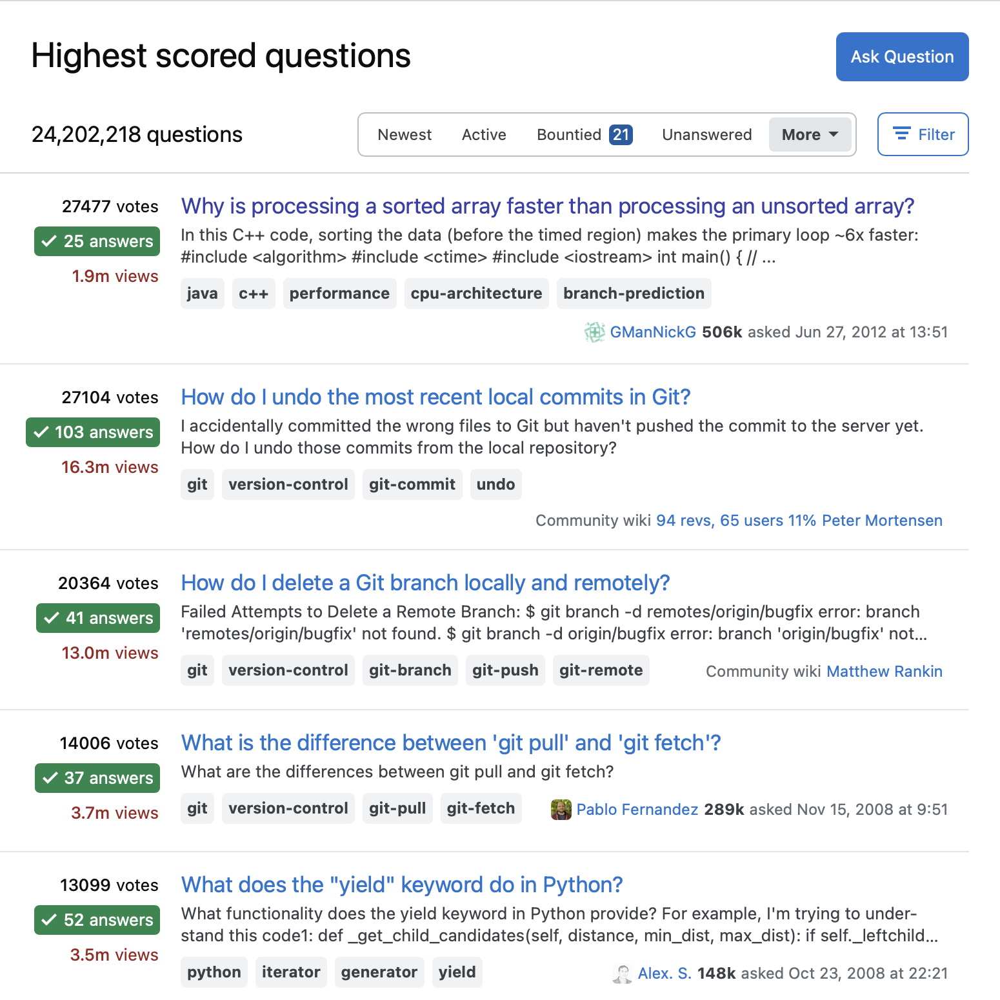

## Introduction
There's a sign up in the Computer Science building on campus that says "Programming is 10% writing code and 90% understanding why it doesn't work". I always give a slight chuckle when I walk past it, because in my experience it is 100% true. This is exactly why everyone says strong commenting and documentation skills are integral to being a successful software engineering. Not only does it help you understand your own code, but it also helps other's understand your code. This is key for me, because I do my best problem solving when discussing with others. If they are unable to understand the code I've written, how can I expect them to help me out? That's why I try my best to ask smart questions.

## What is a Smart Question?
Smart questions, to me, are questions that provide as much information as is necessary, and no more. I'm sure you can understand why the former is important, but not many people understand the latter half of that. I think providing unnecessary information can often confuscate the foundational question, which can lead to tangential trains of thought that lead nowhere. In addition to this, I think a smart question can only be asked by someone who truly understands the work they've done, or at least is able to explain their reasoning behind what got them to the point they're at.

### Example from Stack Overflow
Obviously, people appreciate smart questions. This is why it was incredibly easy to find smart questions on Stack Overflow. All I had to do was sort by the highest-rated questions, and the first result was [this](https://stackoverflow.com/questions/11227809/why-is-processing-a-sorted-array-faster-than-processing-an-unsorted-array). This question stems from a user asking why processing sorted arrays is quicker than processing unsorted arrays in C++. What makes this a smart question is that the asker includes all the necessary code, and none extra. In addition to this, they give some quantifiable data which visually explains their issue. The icing on the cake, however, is they explain what they've tried to resolve the issue, alongside their thoughts as to what might be causing it. Finally, they end with specific questions. They don't just ask "hey, can you fix this?" Instead, they ask for specific answers about their problem, showing they're educated on the issue and understand their work. 

## What is a Not-So-Smart Question?
On the other end of the spectrum are askers who say exactly that: "hey, whats this problem?" Not-So-Smart Questions consist of very little information, and sometimes completely unnecessary information. On top of that, the asker barely understands what they're asking, so they can't point anyone in the right direction. I knew these types of questions existed, as when perusing stack overflow in the past I've come across my fair share of comments saying something along the lines of "we aren't going to do the work for you".

### Example from Stack Overflow
It took me a bit more time to find a Not-So-Smart Question on Stack Overflow, as their users are pretty strict on question guidelines. That being said, I was able to find [this](https://stackoverflow.com/questions/74706561/how-to-setup-visual-studio-code-for-c-for-windows). While this question is by far not the worst, it doesn't provide much helpful information. Essentially, the asker wants to know how to set up VS Code, but they have no clue how to do it. As expected, one of the top comments by Zoltán
says "Your question is too general, don't expect anyone to write a tutorial for you..." That being said, there are still some kind people willing to help. The most helpful comment links to some resources from VSCode themselves, walking through some potential options. While this is useful to point the asker towards the answer, it shows how if the asker understood their question a bit better, they could've found the answer easily through Google.

## Personal Relevance
This whole 'you could've just googled it' is something I have plenty of experience with. Working as a Help Desk Consultant on campus, I often find myself wondering if my job title should be 'Professional Googler'. Many of the problems I help solve could be solved through a simple search. That being said, I do find myself appreciating the people who ask us smart questions. I found myself telling my coworkers to look at an email that came in just a few days ago. I was baffled by how much information they provided. They outlined the issue, explained what troubleshooting they had done, and asked for specific help. I found myself not knowing how to respond, as my typical rhythm had been thrown off! This just goes to show how easily you can make someone else's day by just taking the time to do your research, and explain yourself in whole.
