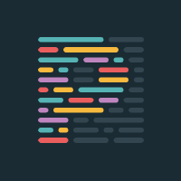

## Initial Thoughts
Going back to the first time I wrote code, I tried to follow my own self-imposed standards. Things like adding spaces between operators, and where you put the curly brace were things that I was steadfast on my opinions. Those opinions have shifted slightly, yet I still have my own way of doing things. It is for this reason that I was initially hesitant to start adhereing to 'true' coding standards. I was worried I would feel a piece of my self-agency disappear. While that didn't necessarily happen, it's still taking me some time to get used to the differences.

## Conflicts
I definitely think some of the standards we adhere to are silly. One example is Prettier's curly braces standard. I started programming putting the curly brace on the same line as the code it's attached to. It was during Ravi Narayan's ICS212 class at UH Manoa that made me switch. Ravi required us to put curly braces on a separate line. I, of course, thought this made zero sense. That was until I got used to it, and it helped me maintain readability within my code. Fast forward a semester, when we start using Prettier in ICS314 and it puts the curly braces back on the starting line. I find it hard to adhere to a strict "standard" when there isn't an agreed upon rule for that standard. But who knows, maybe I'll grow away from separated curly brackets as quickly as I grew towards them.

## Efficiency
I find that most of the Prettier's standards I already adhere to. The majority of the time one shows up is when I haven't finished a piece of code, or make a typo. This can get annoying, when it feels like I'm being yelled at for not returning the proper type in a function when I haven't even finished writing the function! I'll have to investigate the sensitivity of these checks, and try to delay them slightly to make my screen less visually disrupting.

Speaking of disrupting, it was a terrible idea to start using Prettier right at the same time I started using Copilot's autocomplete! Both tools start yelling at each other, and whenever I try writing my own code I am bombarded with *twenty thousand* messages suggesting I do otherwise. While the suggestions are useful in the long run, it definitely contributes to stressors and heightened levels of cortisol when I'm working on assignments in class. It doesn't help that I often have a timed deadline that clouds my judgement.

## Push Remarks
See what I did there? Pushing is the **final** thing you're required to do to submit a piece of code to a repository. Altogether, I trust that adhereing to certain standards will maintain readability and documentation going forward, but it's definitely a jump. I am interested to see what standards large software companies adhere to within their codebases, as I see it becoming more important as an increasing number of people work on a project.
