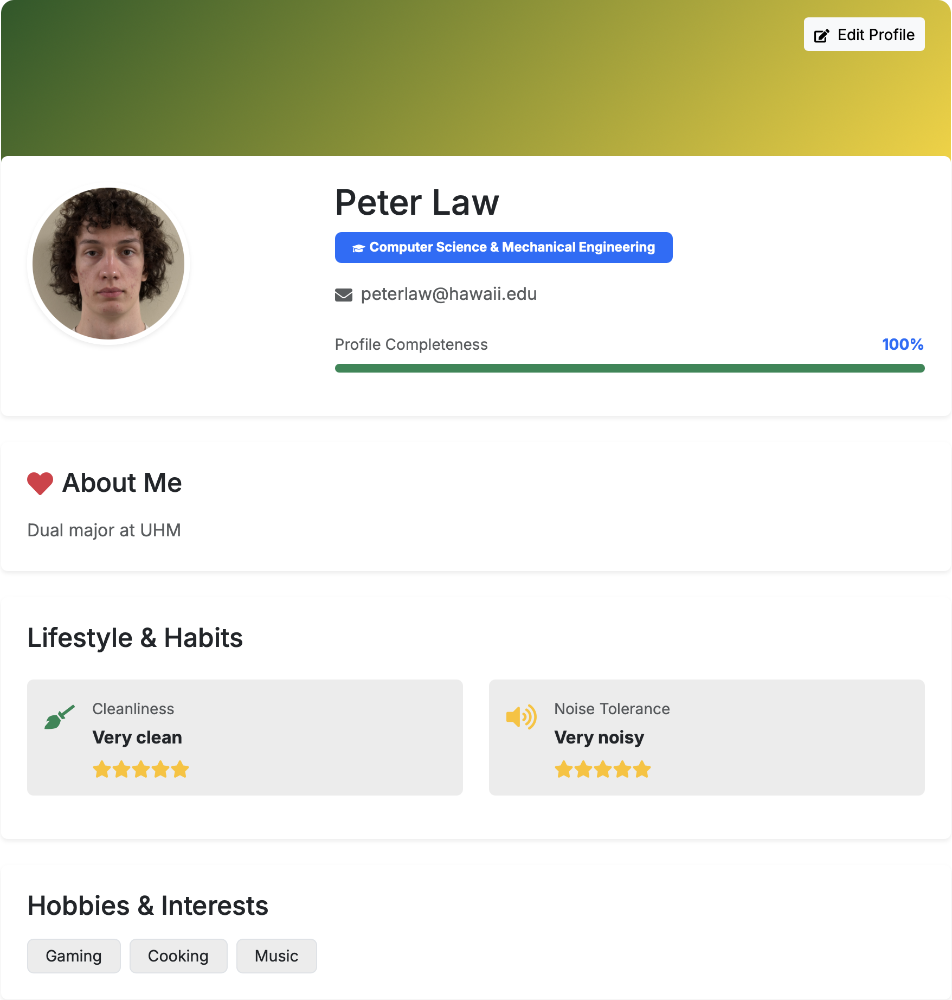

  What started as a simple project that was required for a university course has slowly evolved into the largest project I've worked on thus far! This project, a web-app that is intended to help students at UH Manoa find good roommates, has helped me understand the intricacies of team-based project development. Since all of my previous projects have had at most two people (including me) working on it, this was my first glimpse at struggling through miscommunications and errors that arise when many people work in parallel.

  Most of the work I contributed to the project was organizational documentation and database work. I helped to write the functions required to read to and write from the database. In addition to this, I worked on the project's .io page to organize user guides and explain the process behind the project. I chose to work on the documentation because I like understanding what is required for a project, and that allows me to write down required issues and suggest a path forward. In addition to this, in some of the other projects and teams I have worked with, I struggle immensely when processes and information is not documented successfully. 

  As a team, we chose to have weekly meetings to stay up-to-date with one another on the work we were completing. In addition to this, since it was a school project, we used class times to catch up. It was useful that our instructor required we have "milestones" as deadlines, so that we could focus our efforts on each next deadline instead of having one large impending timeframe. For communication purposes, we used iMessage alongside Discord to communicate effectively. iMessage acted as an easy way to quickly share information, as everyone had their phone on them with easy accessibility. We used Discord for video calls, as not all members had a Apple device that they used to complete their work.

  Altogether, this project has been very valuable to me, not only as a student but as a software engineer. No wonder the course is titled Software Engineering!

  For anyone who wants to check out the page or find out more information, check out [the Roomie Match GitHub](https://github.com/manoa-roomie-match). You can also see my profile in the image below!

