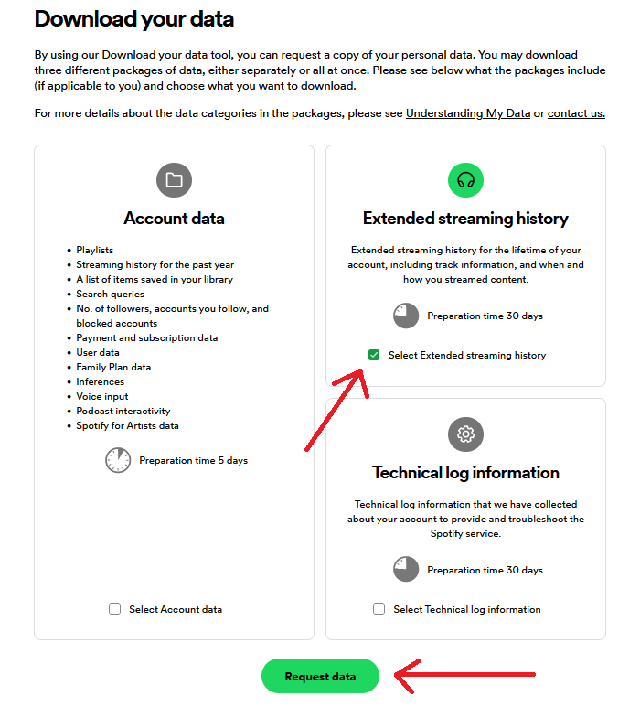

This was a project that started as a solo idea meant as a small gift, and turned into a mini project I built with one of my best friends. I had wanted to build something that allowed me to make sense of the JSON files I received when requesting my listening history from Spotify. I wasn't aware of how many iterations I would have to go through to achieve that feat.

It started off as a small project where I used arrays to store all my data. After bringing on my friend, I realized how that wasn't going to be sustainable with the large amounts of data I was working with. From there, we tried to use a Microsoft Access database. We struggled getting that integrated with Java, as we were using JDBC and MS Access has it's own issues that I won't get into right now. We then switched through one other database before landing on Azure. This worked since we were able to use the free subscriptions and were working with a small enough scope that it didn't cost us any money.

We were able to build out a crude GUI with Swing, and after we got it all set up we were very satisfied. Looking back on this project now, there are plenty of ways we could refactor our code to make it significantly more efficient. Additionally, I would like to rewrite it in Python for two reasons. One: to use a project I'm already familiar with to learn a new language, and two: because it'll most likely be MUCH simpler.

For anyone who wants to download their data, see the instruction image below, courtesy of [Trackify's instructions](https://support.trackify.am/import/guide).

